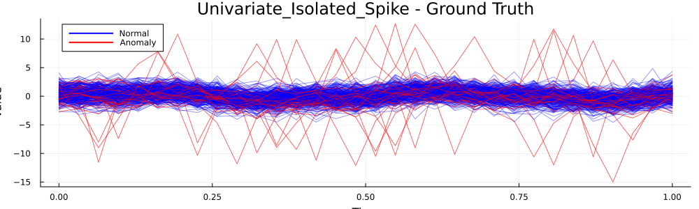
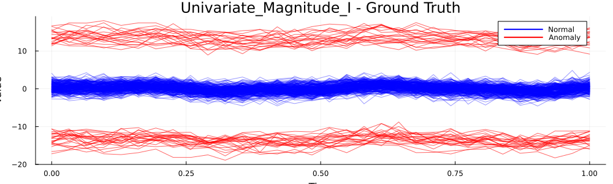
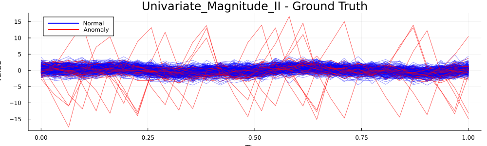
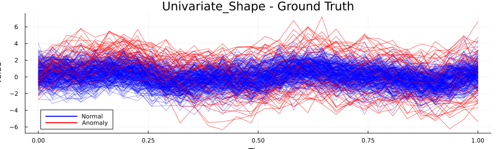
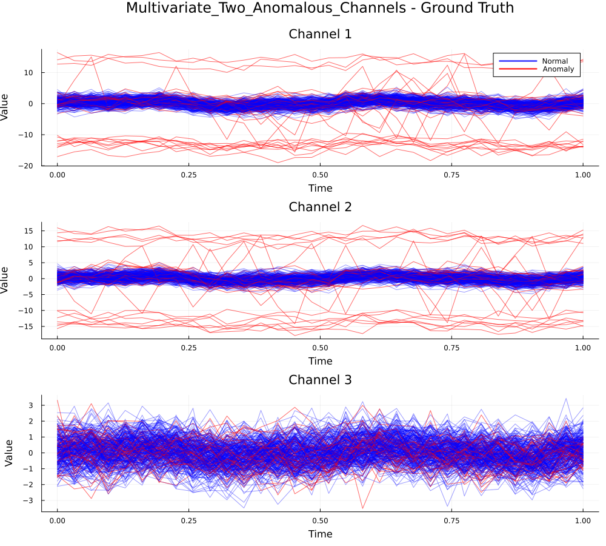

# Simulation Summary

## Univariate Isolated Spike

### Mean Results

| Method | Precision | Recall | F1 | Accuracy |TP|TN|FP|FN|
|--------|-----------|--------|----|----------|----|----|----|----|
| depth.FM | 0.2265 | 0.7124 | 0.3355 | 0.5699 | 32 | 139 | 116 | 13 |
| depth.RP | 0.3445 | 0.7458 | 0.4599 | 0.7318 | 34 | 186 | 69 | 11 |
| depth.RPD | 0.838 | 0.8371 | 0.8333 | 0.9496 | 38 | 247 | 8 | 7 |
| depth.RT | 0.6466 | 0.7858 | 0.7034 | 0.9003 | 35 | 235 | 20 | 10 |
| depth.mode | **0.9382** | **0.9604** | **0.9485** | **0.9843** | 43 | 252 | 3 | 2 |
| WICMAD deriv | 0.7068 | 0.52 | 0.514 | 0.92 | 23 | 253 | 2 | 22 |
| WICMAD raw | 0.7662 | 0.7233 | 0.7178 | 0.9518 | 33 | 253 | 2 | 12 |

### Median Results

| Method | Precision | Recall | F1 | Accuracy |TP|TN|FP|FN|
|--------|-----------|--------|----|----------|----|----|----|----|
| depth.FM | 0.2256 | 0.7333 | 0.3357 | 0.5733 | 33 | 139 | 116 | 12 |
| depth.RP | 0.3333 | 0.7556 | 0.4554 | 0.7417 | 34 | 190 | 65 | 11 |
| depth.RPD | 0.8438 | 0.8444 | 0.8333 | 0.95 | 38 | 248 | 7 | 7 |
| depth.RT | 0.6481 | 0.7778 | 0.703 | 0.9033 | 35 | 236 | 19 | 10 |
| depth.mode | 0.9375 | 0.9556 | 0.9545 | 0.9867 | 43 | 252 | 3 | 2 |
| WICMAD deriv | 0.9778 | 0.9333 | 0.6692 | 0.86 | 42 | 255 | 0 | 3 |
| WICMAD raw | **1** | **0.9778** | **0.9888** | **0.9967** | 44 | 255 | 0 | 1 |

## Univariate Magnitude I

### Mean Results

| Method | Precision | Recall | F1 | Accuracy |TP|TN|FP|FN|
|--------|-----------|--------|----|----------|----|----|----|----|
| depth.FM | **1** | **1** | **1** | **1** | 45 | 255 | 0 | 0 |
| depth.RP | 0.9993 | **1** | 0.9997 | 0.9999 | 45 | 255 | 0 | 0 |
| depth.RPD | 0.7726 | 0.8644 | 0.8102 | 0.9364 | 39 | 242 | 13 | 6 |
| depth.RT | 0.7711 | 0.9009 | 0.8271 | 0.9421 | 41 | 242 | 13 | 4 |
| depth.mode | **1** | **1** | **1** | **1** | 45 | 255 | 0 | 0 |
| WICMAD deriv | 0.4692 | 0.48 | 0.4739 | 0.9192 | 22 | 254 | 1 | 23 |
| WICMAD raw | 0.7376 | 0.82 | 0.7666 | 0.9502 | 37 | 248 | 7 | 8 |

### Median Results

| Method | Precision | Recall | F1 | Accuracy |TP|TN|FP|FN|
|--------|-----------|--------|----|----------|----|----|----|----|
| depth.FM | **1** | **1** | **1** | **1** | 45 | 255 | 0 | 0 |
| depth.RP | **1** | **1** | **1** | **1** | 45 | 255 | 0 | 0 |
| depth.RPD | 0.7942 | 0.8667 | 0.8276 | 0.9467 | 39 | 245 | 10 | 6 |
| depth.RT | 0.7632 | 0.9111 | 0.8186 | 0.9433 | 41 | 243 | 12 | 4 |
| depth.mode | **1** | **1** | **1** | **1** | 45 | 255 | 0 | 0 |
| WICMAD deriv | 0 | 0 | 0 | 0.85 | 0 | 255 | 0 | 45 |
| WICMAD raw | **1** | **1** | **1** | **1** | 45 | 255 | 0 | 0 |

## Univariate Magnitude II

### Mean Results

| Method | Precision | Recall | F1 | Accuracy |TP|TN|FP|FN|
|--------|-----------|--------|----|----------|----|----|----|----|
| depth.FM | 0.2225 | 0.7198 | 0.3331 | 0.5608 | 32 | 136 | 119 | 13 |
| depth.RP | 0.4434 | 0.7931 | 0.5582 | 0.8068 | 36 | 206 | 49 | 9 |
| depth.RPD | 0.9369 | 0.9327 | 0.9335 | 0.9801 | 42 | 252 | 3 | 3 |
| depth.RT | 0.7771 | 0.8822 | 0.8238 | 0.9431 | 40 | 243 | 12 | 5 |
| depth.mode | **0.9886** | **0.9944** | **0.9914** | **0.9974** | 45 | 254 | 1 | 0 |
| WICMAD deriv | 0.6801 | 0.4389 | 0.4466 | 0.9151 | 20 | 255 | 0 | 25 |
| WICMAD raw | 0.8196 | 0.7853 | 0.7573 | 0.9538 | 35 | 251 | 4 | 10 |

### Median Results

| Method | Precision | Recall | F1 | Accuracy |TP|TN|FP|FN|
|--------|-----------|--------|----|----------|----|----|----|----|
| depth.FM | 0.213 | 0.7556 | 0.3302 | 0.5617 | 34 | 134 | 120 | 11 |
| depth.RP | 0.4331 | 0.8111 | 0.5516 | 0.815 | 36 | 208 | 47 | 8 |
| depth.RPD | 0.9362 | 0.9444 | 0.9348 | 0.98 | 42 | 252 | 3 | 2 |
| depth.RT | 0.7736 | 0.8889 | 0.823 | 0.9433 | 40 | 244 | 12 | 5 |
| depth.mode | **1** | **1** | 0.989 | 0.9967 | 45 | 255 | 0 | 0 |
| WICMAD deriv | **1** | 0.0444 | 0.0851 | 0.8567 | 2 | 255 | 0 | 43 |
| WICMAD raw | **1** | **1** | **1** | **1** | 45 | 255 | 0 | 0 |

## Univariate Shape

### Mean Results

| Method | Precision | Recall | F1 | Accuracy |TP|TN|FP|FN|
|--------|-----------|--------|----|----------|----|----|----|----|
| depth.FM | 0.8828 | **0.9318** | 0.905 | 0.9705 | 42 | 249 | 6 | 3 |
| depth.RP | 0.5967 | 0.8531 | 0.693 | 0.8839 | 38 | 227 | 28 | 7 |
| depth.RPD | 0.2526 | 0.6211 | 0.343 | 0.6325 | 28 | 162 | 93 | 17 |
| depth.RT | 0.6635 | 0.8718 | 0.7493 | 0.9119 | 39 | 234 | 21 | 6 |
| depth.mode | **0.961** | **0.9593** | **0.9595** | **0.9878** | 43 | 253 | 2 | 2 |
| WICMAD deriv | 0.3955 | 0.3011 | 0.2751 | 0.8794 | 14 | 250 | 5 | 31 |
| WICMAD raw | 0.9104 | 0.786 | 0.835 | 0.96 | 35 | 253 | 2 | 10 |

### Median Results

| Method | Precision | Recall | F1 | Accuracy |TP|TN|FP|FN|
|--------|-----------|--------|----|----------|----|----|----|----|
| depth.FM | 0.8776 | **0.9333** | 0.9072 | 0.97 | 42 | 249 | 6 | 3 |
| depth.RP | 0.5932 | 0.8667 | 0.699 | 0.89 | 39 | 228 | 26 | 6 |
| depth.RPD | 0.2347 | 0.6222 | 0.3385 | 0.6467 | 28 | 166 | 89 | 17 |
| depth.RT | 0.6607 | 0.8667 | 0.75 | 0.9133 | 39 | 235 | 20 | 6 |
| depth.mode | 0.9762 | **0.9556** | **0.9659** | **0.99** | 43 | 254 | 1 | 2 |
| WICMAD deriv | 0 | 0 | 0 | 0.85 | 0 | 255 | 0 | 45 |
| WICMAD raw | **1** | 0.8444 | 0.9157 | 0.9767 | 38 | 255 | 0 | 7 |

## Multivariate One Anomalous Channel

### Mean Results

| Method | Precision | Recall | F1 | Accuracy |TP|TN|FP|FN|
|--------|-----------|--------|----|----------|----|----|----|----|
| depth.FMp | 0.5849 | 0.4924 | 0.51 | 0.8582 | 22 | 235 | 20 | 23 |
| depth.RPp | 0.3183 | 0.5956 | 0.3993 | 0.7246 | 27 | 191 | 64 | 18 |
| fdaoutlier.msplot | 0.15 | **1** | 0.2609 | 0.15 | 45 | 0 | 255 | 0 |
| mrfDepth.fOutl | **1** | **1** | **1** | **1** | 45 | 255 | 0 | 0 |
| WICMAD raw | 0.7998 | 0.876 | 0.7857 | 0.9371 | 39 | 242 | 13 | 6 |

### Median Results

| Method | Precision | Recall | F1 | Accuracy |TP|TN|FP|FN|
|--------|-----------|--------|----|----------|----|----|----|----|
| depth.FMp | 0.5505 | 0.4889 | 0.505 | 0.8633 | 22 | 237 | 18 | 23 |
| depth.RPp | 0.301 | 0.6 | 0.394 | 0.7267 | 27 | 192 | 63 | 18 |
| fdaoutlier.msplot | 0.15 | **1** | 0.2609 | 0.15 | 45 | 0 | 255 | 0 |
| mrfDepth.fOutl | **1** | **1** | **1** | **1** | 45 | 255 | 0 | 0 |
| WICMAD raw | **1** | **1** | 0.9156 | 0.9783 | 45 | 255 | 0 | 0 |

## Multivariate Two Anomalous Channels

### Mean Results

| Method | Precision | Recall | F1 | Accuracy |TP|TN|FP|FN|
|--------|-----------|--------|----|----------|----|----|----|----|
| depth.FMp | 0.7384 | 0.5653 | 0.6282 | 0.8993 | 25 | 244 | 11 | 20 |
| depth.RPp | 0.583 | 0.644 | 0.5907 | 0.8629 | 29 | 230 | 25 | 16 |
| fdaoutlier.msplot | 0.15 | **1** | 0.2609 | 0.15 | 45 | 0 | 255 | 0 |
| mrfDepth.fOutl | **0.9996** | 0.9998 | **0.9997** | **0.9999** | 45 | 255 | 0 | 0 |
| WICMAD raw | 0.7021 | 0.8596 | 0.7392 | 0.9245 | 39 | 239 | 16 | 6 |

### Median Results

| Method | Precision | Recall | F1 | Accuracy |TP|TN|FP|FN|
|--------|-----------|--------|----|----------|----|----|----|----|
| depth.FMp | 0.7534 | 0.5556 | 0.6234 | 0.9033 | 25 | 247 | 8 | 20 |
| depth.RPp | 0.5676 | 0.6444 | 0.5926 | 0.8767 | 29 | 232 | 22 | 16 |
| fdaoutlier.msplot | 0.15 | **1** | 0.2609 | 0.15 | 45 | 0 | 255 | 0 |
| mrfDepth.fOutl | **1** | **1** | **1** | **1** | 45 | 255 | 0 | 0 |
| WICMAD raw | 0.5422 | **1** | 0.7031 | 0.8733 | 45 | 255 | 0 | 0 |

## Multivariate Three Anomalous Channels

### Mean Results

| Method | Precision | Recall | F1 | Accuracy |TP|TN|FP|FN|
|--------|-----------|--------|----|----------|----|----|----|----|
| depth.FMp | 0.9701 | 0.9851 | 0.9773 | 0.9931 | 44 | 254 | 1 | 1 |
| depth.RPp | 0.9006 | 0.9064 | 0.9014 | 0.9701 | 41 | 250 | 5 | 4 |
| fdaoutlier.msplot | 0.15 | **1** | 0.2609 | 0.15 | 45 | 0 | 255 | 0 |
| mrfDepth.fOutl | **1** | **1** | **1** | **1** | 45 | 255 | 0 | 0 |
| WICMAD raw | 0.7572 | 0.8176 | 0.7367 | 0.9359 | 37 | 244 | 11 | 8 |

### Median Results

| Method | Precision | Recall | F1 | Accuracy |TP|TN|FP|FN|
|--------|-----------|--------|----|----------|----|----|----|----|
| depth.FMp | 0.9778 | **1** | 0.9783 | 0.9933 | 45 | 254 | 1 | 0 |
| depth.RPp | 0.9121 | 0.9111 | 0.904 | 0.97 | 41 | 251 | 4 | 4 |
| fdaoutlier.msplot | 0.15 | **1** | 0.2609 | 0.15 | 45 | 0 | 255 | 0 |
| mrfDepth.fOutl | **1** | **1** | **1** | **1** | 45 | 255 | 0 | 0 |
| WICMAD raw | **1** | **1** | **1** | **1** | 45 | 255 | 0 | 0 |
